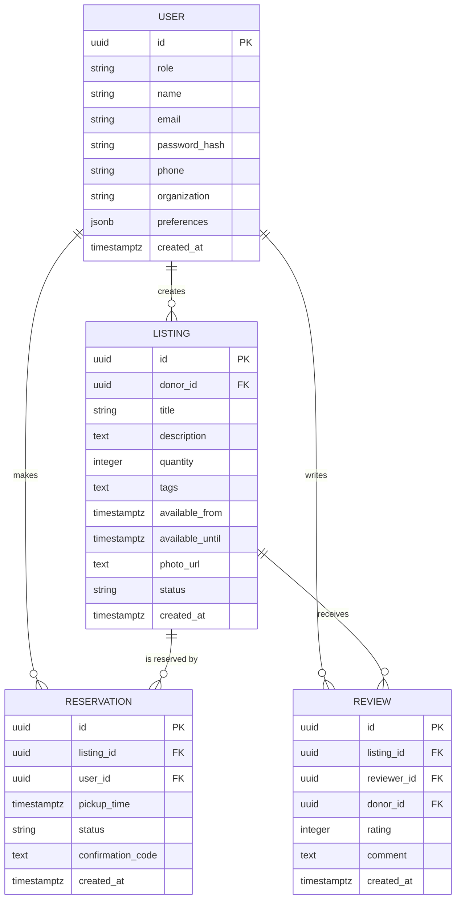

# Community Food Share Platform

## Overview

Community Food Share Platform is a web application that connects donors with
community members who can benefit from surplus food. The platform enables
donors to publish available food items, allows users to reserve and pick up the
items, and provides a feedback loop through post-pickup reviews. The goal is to
minimize food waste while supporting local communities.

## System Features

### 1. Food Listing Management

* Donors can create detailed food listings that include titles, descriptions,
  availability windows, and photos.
* Listings can be edited to update quantities, pickup times, or descriptions.
* Donors can remove listings when items are no longer available.
* Listings support optional tags (for example, "vegetarian" or "allergen
  information") to help users quickly find suitable items.

### 2. Reservation and Pickup Process

* Users browse available items and place reservations for specific pickup
  windows.
* Donors receive notifications for new reservations and can confirm or decline
  them.
* Confirmed reservations display scheduled pickup details to both parties and
  provide a QR code or confirmation code for verification during pickup.
* Donors can mark items as "picked up" once the hand-off is complete, which
  updates availability in real time.

### 3. Review System

* After pickup, users receive prompts to rate donors and write reviews about
  the pickup experience.
* Reviews include a star rating (1–5) and optional written feedback.
* Aggregated ratings appear on donor profiles to help future users make
  informed choices.

### 4. User Accounts

* Role-based authentication distinguishes between donor and user (recipient)
  accounts.
* Profiles store contact details, organization names (for donors), and pickup
  preferences.
* Passwords are securely hashed and personal data is protected with access
  controls.
* Account dashboards provide quick access to listings, reservations, and review
  history.

## System Architecture

| Layer            | Technologies                                    |
| ---------------- | ------------------------------------------------ |
| Frontend         | React, TypeScript, Tailwind CSS                  |
| Backend          | Node.js, Express.js                              |
| Database         | PostgreSQL                                       |
| Authentication   | JSON Web Tokens (JWT) with refresh token support |
| Storage          | AWS S3 or equivalent object storage for photos   |
| Notifications    | Email (SendGrid) and optional SMS integration    |

### High-Level Components

1. **Frontend Web App** – Provides responsive interfaces for browsing
   listings, managing reservations, and handling donor workflows.
2. **API Gateway** – RESTful endpoints that power listing management,
   reservations, reviews, and user account features.
3. **Database Layer** – Stores users, listings, reservations, and reviews with
   relational integrity and audit timestamps.
4. **Storage Service** – Stores uploaded listing images and generates secure
   public URLs.

## Core Data Models

## API Outline

| Feature                    | Method | Endpoint                  | Description                              |
| -------------------------- | ------ | ------------------------- | ---------------------------------------- |
| User registration/login    | POST   | `/api/auth/register`      | Create a new user or donor account       |
|                            | POST   | `/api/auth/login`         | Authenticate and issue tokens            |
| Listing management         | GET    | `/api/listings`           | List all active listings                 |
|                            | POST   | `/api/listings`           | Create a new listing (donor only)        |
|                            | PATCH  | `/api/listings/:id`       | Update listing details (donor only)      |
|                            | DELETE | `/api/listings/:id`       | Remove a listing (donor only)            |
| Reservation lifecycle      | POST   | `/api/reservations`       | Reserve an item                          |
|                            | PATCH  | `/api/reservations/:id`   | Confirm or cancel a reservation          |
|                            | PATCH  | `/api/reservations/:id/pickup` | Mark reservation as picked up      |
| Review submission          | POST   | `/api/reviews`            | Submit a review after pickup             |
|                            | GET    | `/api/donors/:id/reviews` | Fetch reviews for a donor                |
| Account management         | GET    | `/api/users/me`           | Retrieve profile data                    |
|                            | PATCH  | `/api/users/me`           | Update account information               |

## User Flows

1. **Donor Listing Flow**
   1. Donor logs in and navigates to the dashboard.
   2. Donor creates a new listing, uploads images, and sets pickup window.
   3. Listing appears in the public feed.
   4. Donor receives reservation requests and confirms them.
   5. After pickup, donor marks the item as picked up.

2. **User Reservation Flow**
   1. User logs in and browses available listings.
   2. User reserves an item and selects a pickup time.
   3. User receives confirmation with pickup instructions.
   4. User completes the pickup and provides confirmation code.
   5. User leaves a review for the donor.

## Security Considerations

* Implement HTTPS for all client-server communication.
* Enforce role-based access control for all API endpoints.
* Use refresh tokens and short-lived access tokens to reduce risk of misuse.
* Sanitize file uploads and restrict accepted MIME types for listing photos.
* Apply rate limiting to authentication and listing endpoints to deter abuse.

## Implementation Roadmap

| Phase | Duration | Milestones                                                  |
| ----- | -------- | ----------------------------------------------------------- |
| 1     | 1 week   | Project setup, database schema, authentication scaffolding |
| 2     | 2 weeks  | Listing management API + donor UI                          |
| 3     | 2 weeks  | Reservation workflow, notifications, pickup confirmations  |
| 4     | 1 week   | Review system and donor profile enhancements               |
| 5     | 1 week   | Testing, accessibility audit, production deployment        |

## Testing Strategy

* Unit tests with Jest (frontend) and Vitest or Jest (backend) for key logic.
* Integration tests using Supertest for API endpoints.
* End-to-end tests with Playwright covering reservation and pickup flows.
* Automated CI pipeline triggered on pull requests to enforce code quality.

## Deployment

* Backend deployed on a containerized environment (Docker + AWS ECS or Azure
  App Service).
* Frontend served via static hosting (Netlify, Vercel, or S3 + CloudFront).
* Database hosted on managed PostgreSQL (AWS RDS, Azure Database for
  PostgreSQL).
* Continuous deployment pipeline publishes new versions after successful tests.

## Future Enhancements

* Mobile app with push notifications for real-time reservation updates.
* Integration with local shelters and community centers for bulk pickups.
* Analytics dashboard for donors to track impact (total meals provided, waste
  reduced).
* Multilingual support to improve accessibility for diverse communities.
